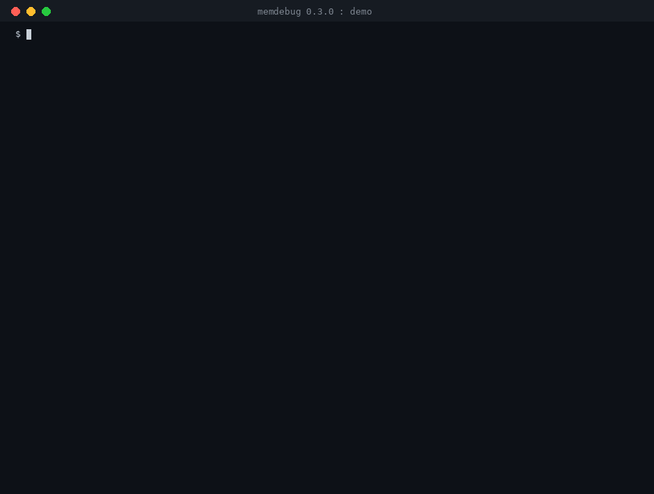

# memdebug

**See what your AI agent's memory holds, what changed, and put it back.** A local, agent-neutral tool for people who run
agents whose memory they can reach: notes in a folder or git repository, Open WebUI's memory, or a self-hosted Mem0.

That is `memdebug demo` as released in 0.3.0, paced for reading (the real run takes about a second on Linux and a few seconds on Windows).
The unpaced recording is [`docs/demo.cast`](docs/demo.cast): `asciinema play docs/demo.cast`.

An agent's memory is built from text it read at runtime, and text can be planted: an email, a web page, a document.
Nobody reviews all of it. memdebug records what the memory holds in a tamper-evident ledger, shows what changed and when,
catches edits that bypassed the store's own history, compares snapshots, flags wording worth a second look, and rolls markdown memory
back safely.

It is an **observer**: it never sits between the agent and its memory, never talks to the agent, and runs entirely on your
computer. It does not block attacks as they happen (run it next to runtime guards). For Claude Code it can point at the logged session
behind a flagged change, as evidence and never as proof; for any other agent it cannot say *which conversation* wrote a memory. See
[docs/threat-model.md](docs/threat-model.md) for exactly what it does and does not do.

> **Status: alpha (0.4).** The parts described here work. The tests run on every push on Linux, Windows and macOS (Python 3.10, 3.12 and 3.14), and
> the author also runs them on Windows 11, but expect rough edges. [ROADMAP.md](ROADMAP.md) lists what is built and what is next.

## Try it in a minute

You need Python 3.10 or newer and git 2.31 or newer.

    pipx install memdebug
    memdebug demo                 # made-up agent, made-up attack, the real tools; nothing of yours is touched

No pipx? Use a virtual environment, which works the same way everywhere:

    python -m venv memdebug-env
    memdebug-env\Scripts\activate          # Windows; on macOS and Linux: source memdebug-env/bin/activate
    pip install memdebug

If your shell cannot find the `memdebug` command, `python -m memdebug` (on Windows `py -m memdebug`) does the same thing.

The demo plants an instruction into a note behind git's back, shows memdebug catching it, rolls the file back without losing
the planted text, and shows the ledger noticing a tampered copy. It works in a throwaway folder and removes it afterwards.
`memdebug demo --serve` then shows it in the browser viewer.

## Watch your own agent's memory

You point memdebug at the memory; it does not hook into the agent.

    memdebug agents      # which AI agents are on this computer, and what each keeps (looks at folder names only)
    memdebug setup       # finds that memory, asks before adding anything, saves a first snapshot of each
    memdebug check       # looks for changes once; exit code 1 means something needs a look
    memdebug watch       # keeps looking and says so when something changes (Ctrl+C to stop)
    memdebug serve       # the same story in your browser, read-only

If something looks wrong, put it back:

    memdebug rollback store NAME --to s1           # a dry run: shows what would change, writes nothing
    memdebug rollback store NAME --to s1 --apply   # does it, after you type the snapshot id

Run `memdebug selftest` once on any new machine: it proves the platform-dependent protections hold there, and says SKIP (never PASS) for
anything it could not prove. Treat the ledger as sensitive: it contains your agent's memory text.

## Learn more

* [docs/usage.md](docs/usage.md): adding stores by hand, which stores can be rolled back, reports, the witness, hints, the browser viewer.
* [docs/rollback.md](docs/rollback.md): what a rollback guarantees, for plain folders and for git notes.
* [docs/how-it-works.md](docs/how-it-works.md): the design, how the pieces fit, and how the project is tested and released.
* [docs/agents.md](docs/agents.md): which agents it knows and where each keeps its memory. [docs/windows.md](docs/windows.md): Windows notes.
* [docs/threat-model.md](docs/threat-model.md): what is defended, against whom, and the known limits.
* [ROADMAP.md](ROADMAP.md), [CHANGELOG.md](CHANGELOG.md) and [docs/releasing.md](docs/releasing.md).
* [SECURITY.md](SECURITY.md): how to report a problem. [CONTRIBUTING.md](CONTRIBUTING.md): how to help.

## Development

    pip install -e ".[dev]"
    pytest -n auto
    memdebug selftest
    ruff check src tests && mypy

See [CONTRIBUTING.md](CONTRIBUTING.md) for the ground rules (everything read from a store is untrusted; adapters only read).

## License

Copyright 2026 Juraj Jumić. Apache License 2.0. See [LICENSE](LICENSE) and [NOTICE](NOTICE).
